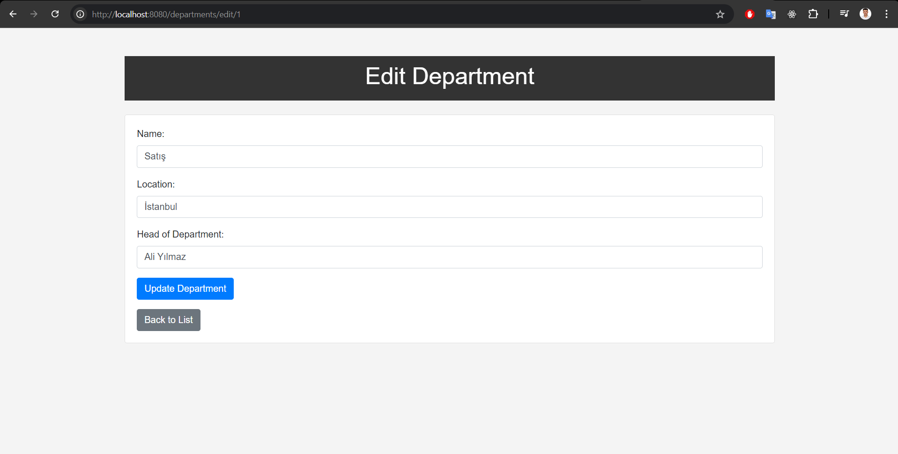

# hibernateAndJpa Project

## Overview

`hibernateAndJpa` is a Java-based project demonstrating the use of Hibernate ORM and JPA (Java Persistence API) for managing data in a relational database. This project showcases various CRUD operations, as well as entity management and service layer implementation.

## Features

- **Entity Management**: Defines and manages the `Department` entity.
- **CRUD Operations**: Implements Create, Read, Update, and Delete operations using Hibernate and JPA.
- **Service Layer**: Utilizes a service layer to handle business logic and interact with the data access layer.
- **Data Access Layer**: Provides data access functionalities using Hibernate.
- **RESTful API**: Exposes a REST API to interact with the `Department` entity.

## Getting Started

### Prerequisites

- Java 17 or higher
- Maven
- Spring Boot
- Hibernate
- JPA
- An RDBMS (e.g., MySQL, PostgreSQL)

### Installation

1. Clone the repository:

   ```bash
   git clone https://github.com/cetinyazici/hibernateAndJpa.git
   ```

2. Navigate to the project directory:
   ```bash
   cd hibernateAndJpa
   ```
3. Install the project dependencies using Maven:
   ```bash
   mvn clean install
   ```
4. Configure the application properties:
   Edit the src/main/resources/application.properties file to include your database configuration:
   ```bash
   spring.datasource.url=jdbc:mysql://localhost:3306/yourdatabase
   spring.datasource.username=yourusername
   spring.datasource.password=yourpassword
   spring.jpa.hibernate.ddl-auto=update
   ```
5. Run the application:

   ```bash
   mvn spring-boot:run

   ```

### Project images



